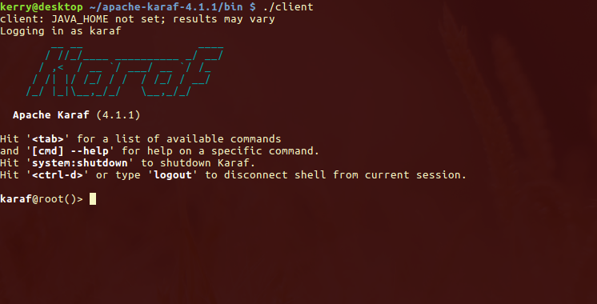
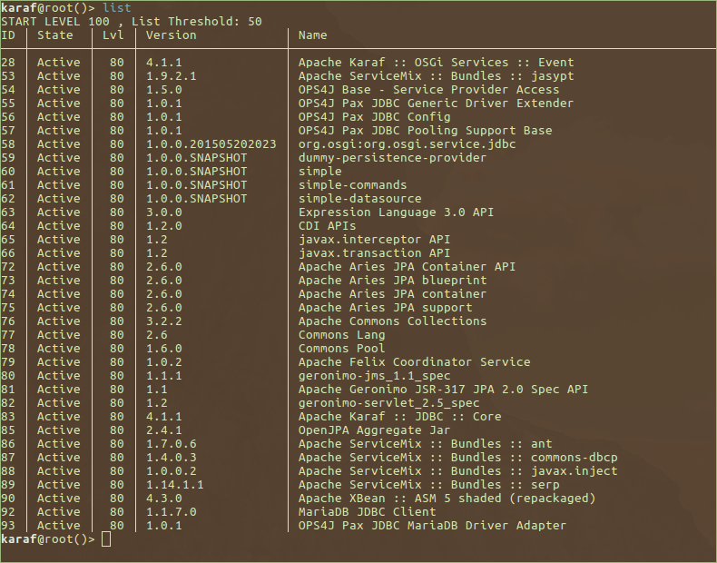

# Simple JPA in an OSGi Container

An example of how to use JPA within a OSGi container.

## Requirements
1. Apache Karaf - the runtime container. Download the latest 4.1.X version from the Karaf website:

    [Apache Karaf Download](https://karaf.apache.org/download.html)

    _(The 4.2.X versions should also work if you want to try them)_

2. MariaDB or MySQL database installed. 

3. `jpa-maven-plugin`. This is not currently available in Maven central so will need to be cloned and built. See [https://github.com/jtkb/jpa-maven-plugin](https://github.com/jtkb/jpa-maven-plugin) (I may make a JavaTechnics-wrapped SNAPSHOT version available in Maven Central)
4. JDK 1.8

5. Maven - any relatively recent version should be fine. Make sure that the `~/.m2` exists.

## Setup

##### 1. Building `jpa-maven-plugin`
Clone the repository specified above and build:

    `mvn clean install`

##### 2. Building the example
With the `master` branch checked out issue the standard Maven build command from the project root:

`mvn clean install`

This will build the OSGi bundles and Karaf features and place them into you local repository.

##### 3. Apache Karaf
It's recommended you check the PGP/MD5/SHA1 of the file you downloaded. Then un-tar/un-zip to a directory of your choice to which you have read/write permissions.

##### 4. MariaDB or MySQL
Ensure that you have a `root` user and the password is blank. If the user and/or password is something other than blank then you will need to change the password in [`persistence.xml`](simple/src/main/resources/META-INF/persistence.xml)

In your database server create a database called `test`. You do not need to apply any schema to this database.

## Startup

1. In a bash terminal change to the `bin` directory off the directory where you installed `Karaf`.

2. Issue the start command to Karaf: `./start`
After a few moments Karaf will start although there will be no indication of this in the terminal window. You can issue the command `./status` which will tell you if Karaf is up and running. If you're on Linux and 'empty' Karaf startup time is typically a few seconds.

3. Issue the client command to take you into the Karaf commandline: `./client` You should be presented with something similar to:

    

4. Install the `simple` JPA feature _repo_ into Karaf by issuing the following command at the prompt:

    `repo-add mvn:com.javatechnics.jpa/simple-commands/1.0.0-SNAPSHOT/xml/features`

5. Now install the `simple` feature by issuing the following command at the prompt:

    `feature:install simple-commands`
    
6. Check the feature has been installed by issuing the following at the prompt:

    `list`
    
    You should see similar to the following:
    
    
    
7. The `simple-commands` feature is now installed!

### Usage
All the available commands can be viewed by issuing the following at the prompt:

`book --help`

To get help on a specific command e.g. `create`, issue the following at the prompt:

`book:create --help`

##### Creating a Book
At the prompt issue:

`book:create <author> <title>`

replacing `<author>` and `<title>` with values of your choosing.

##### Listing Books
At the prompt issue:

`book:getall`

All the books within the database will be printed to the terminal.

## Module Details

##### Simple
Specifies the data objects and persistence unit.

##### Simple Datasource
Specifies a data source for use with a persistence unit.

##### Simple Commands
Specifies Karaf commands that makes use of the 'simple' and 'simple datastore' modules.

##### Dummy Persistence Provider
A facade module that overcomes a resolution issue when installing the 'simple' example via Karaf features.